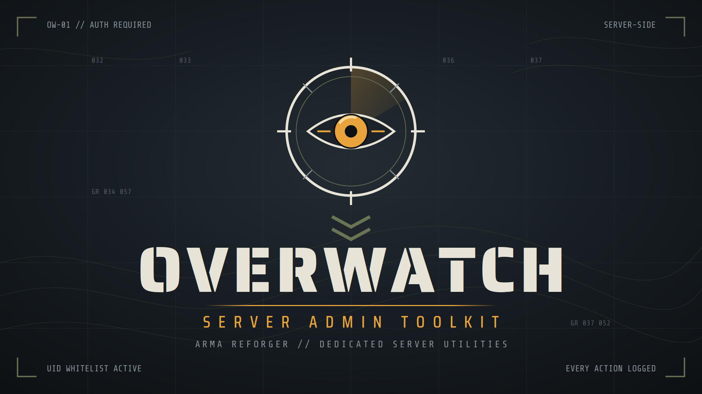

  

**OVERWATCH — Server Admin Toolkit**

A lightweight, server-side admin toolkit for Arma Reforger dedicated servers. No client download, no dependencies — install it on your server and it works for every player who joins.

**Features**
- **Tiered permissions** — UID-based admin whitelist with Moderator, Admin and Owner tiers. Stored in a simple JSON file in your server profile; edit it directly or manage admins in-game.
- **Moderation** — kick and ban with reasons, temporary bans with automatic expiry.
- **Player management** — heal, kill, teleport to player, bring player to you, detailed player info (UID, platform, ping, faction, session time).
- **Communication** — server-wide broadcasts for announcements and restart warnings.
- **Full audit log** — every admin action is written to a log file with timestamp, actor and target. Failed permission attempts are logged too.
- **Fail-safe by design** — all checks run server-side and fail closed. A malformed config grants nobody anything, and clients are never trusted.

**Setup**

1.Add the mod to your server's mod list.
2.Start the server once — Overwatch_Admins.json is generated in your server profile.
3.Add your Identity UID with tier 3 (Owner), restart, done.

**Full documentation**, command list and configuration guide: [https://github.com/Michael4170/Overwatch_Server_Admin_Toolkit]
**Compatibility**
Pure server-side component — works alongside any game mode or mod set, and safe to add or remove without affecting saves. Built and tested against the current Reforger release; version compatibility is tracked on the GitHub page.
**Roadmap**
In-game admin menu with spectate mode, scheduled restart warnings, MOTD on join, and Discord webhook logging are in active development. Suggestions and bug reports welcome via [https://discord.gg/SsM7r8b7ae] or through the Github page.
