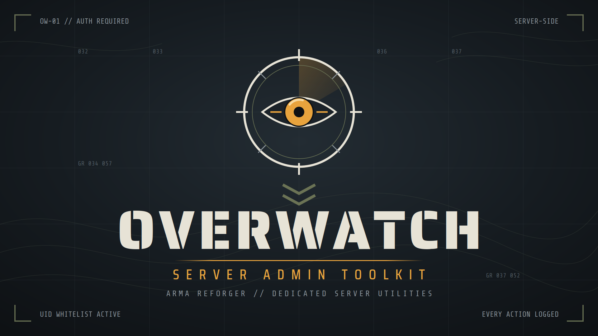

  

OVERWATCH - Server Admin Toolkit
Tiered admin tooling for Arma Reforger dedicated servers. Permissions are keyed to Bohemia identity UIDs and checked server-side, so a client cannot exceed its tier.

FEATURES

* Three tiers — Moderator, Admin, Owner — 21 chat commands, filtered to what you can use.
* In-game admin menu on a keybind — live player list, click-to-action. Same permission checks as chat.
* Spectate — follow any player through their camera.
* Game Master — automatic for qualifying tiers, plus session-only grants with !ow gm.
* Persistent bans — timed or permanent, survive restarts, revocable in game.
* Restart countdown — an on-screen timer before scheduled restarts. It warns only; your host does the restarting.
* Message of the day — a rules panel on the welcome screen, your text and your banner.
* Discord feed — joins, leaves and admin actions to a staff channel.
* Full server-side logging — every action records the actor, the target and both UIDs.

COMMANDS

Moderator: help, admins, heal, players, playerinfo, broadcast, bans, menu Admin: kill, goto, bring, spectate, unspectate, kick, ban, unban, gm, ungm Owner: grant, revoke, discordtest
Type !ow help in game for your tier's list. !ow and /ow both work; !ow is hidden from other players.

SETUP

Nothing to wire up — Overwatch extends the base game mode prefab. First start writes template configs and logs their paths. Add your UID as tier 3, restart, done.
Overwatch fails closed: a bad config grants nobody anything and says so. Countdown, MOTD and Discord ship off.
Discord needs a webhook URL in the config; keep that channel staff-only.

TWO THINGS TO KNOW

Game Master is more power than every command here combined, and nothing done with it reaches Overwatch's log. gmTier sets who gets it — default 2 (Admin), 3 for Owners only, 0 to disable.
Spectate does not notify the target — covert by design, since an admin checking for cheating can't announce it. The log is the only record; set a disclosure policy first.

Full docs and troubleshooting: https://github.com/Michael4170/Overwatch-Server-Admin-Toolkit

Suggestions and bug reports: https://discord.gg/SsM7r8b7ae or the GitHub page.
